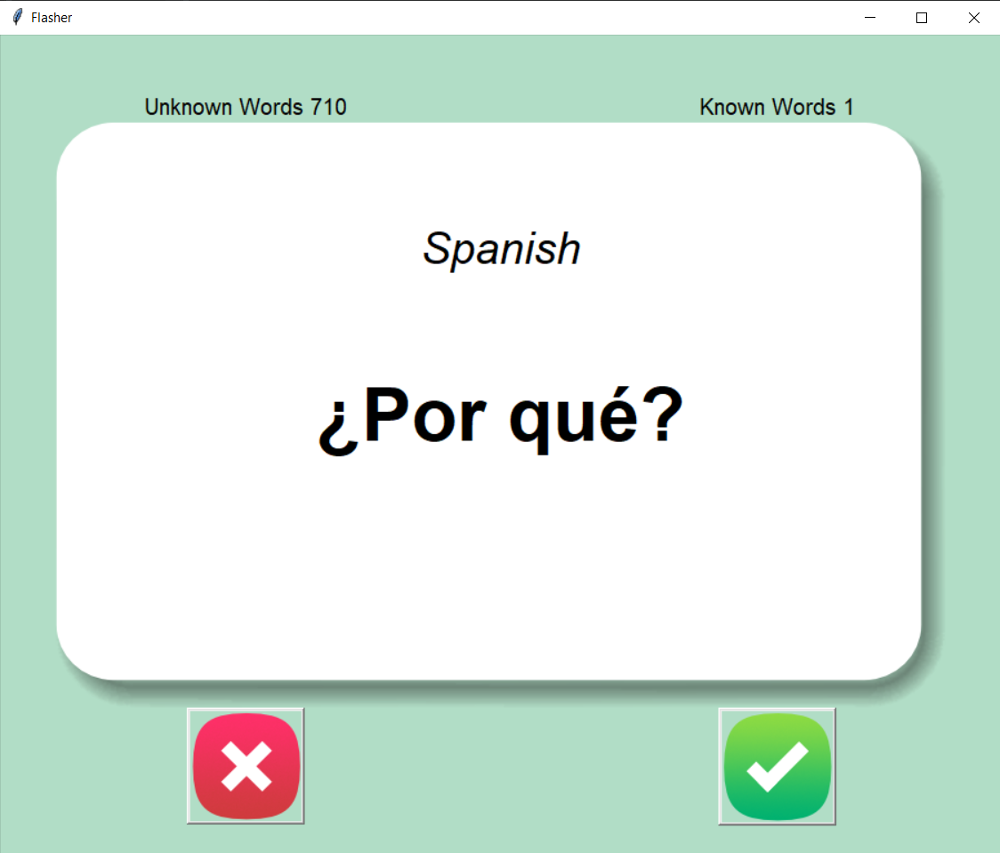

# TKINTER PROJECTS
<h3>This folder contain all my Tkinter projects</h3>
 
 
<h1>1. Flasher</h1>
<h5>Learning spanish word from books is bit boring. If you search on internet there are lot of better and more focused
way to learn. Among all those method one is learning through FlashCard. This method is very old but still it's one of
the most popular method.</h5>
<h5>When used correctly, flash cards allow students to interact with information in a way that makes it easier to 
retain.Flash cards are strategically designed to enhance and encourage active recall. The format, usually a question on one 
side of the card and the answer on the other, requires learners to look at one side and recall the information from 
the other side.Practicing active recall creates stronger neural connections in the brain — making it a very effective 
method for improving memory.</h5>

<h5>Flasher is based on this method. It shows the user a spanish word and wait for 3 second before reveling the answer.
After that
 
 

- If you remember it then click on the check mark. Which tells the program that you remember this word and thus never 
show it again.
- If you don't know the answer then click on the cross button. Now this will tell the program that you don't know this 
word, and therefore ask it later.</h5>

<h5>The smart thing about this app is that it will keep storing the word which you don't know and when you run the 
application again it will ask only those word which you don't know.</h5>

<h3>Currently working to make it more flexible, so that you can learn not only spanish but other language also.</h3>